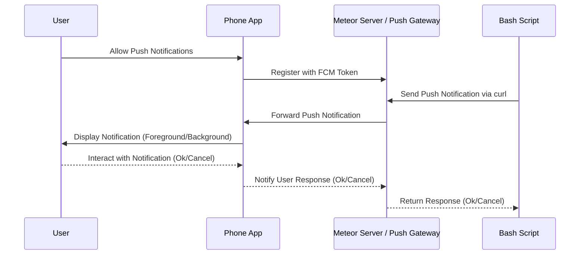

# Meteor React App with Cordova Integration

This is a Meteor application that uses React for the frontend and supports Cordova for mobile platforms. It integrates Firebase Cloud Messaging (FCM) for push notifications using the `@havesource/cordova-plugin-push`.

---
## Sequence Diagram 

---

## Screenshots


### App HomePage


### Push Notification Example (old)


---

## How to Set Up and Run

### Step 1: Clone the Project
```bash
git clone https://github.com/abroa01/mieweb_auth_app.git
cd mieweb_auth_app
```

### Step 2: Install Meteor
If you don’t have Meteor installed:
```bash
curl https://install.meteor.com/ | sh
```

### Step 3: Install Dependencies
Run the following command to install the required packages:
```bash
meteor npm install
```

### Step 4: Run the App
Start the application locally:
```bash
meteor run
```
Access it in your browser at `http://localhost:3000`.

---

## For Mobile Platforms (Cordova)

### Step 1: Add a Platform
To build for Android:
```bash
meteor add-platform android
```

### Step 2: Install Cordova Push Plugin
Add the FCM push notification plugin:
```bash
meteor add cordova:@havesource/cordova-plugin-push@5.0.5
```

### Step 3: Run on Emulator or Device
```bash
meteor run android
meteor run android-device
```

### Step 4: Configure Firebase
1. Download the `google-services.json` file from your Firebase Console.
2. Place it at the app level in the directory: `.meteor/local/cordova-build/platforms/android/app/`.
3. Ensure FCM is enabled in your Firebase project.

---

## Push Notifications

### Sending Push Notifications to Meteor Server
To send push notifications, follow these steps:

1. Ensure the server is running locally on `http://localhost:3000`.
2. Use the following `curl` command to send a push notification:
   ```bash
   curl -X POST \
   -H "Content-Type: application/json" \
   -d '{
       "token": "<FCM_TOKEN>",
       "title": "Test Notification",
       "body": "This is a test message from Meteor.",
       "data": {"customKey": "customValue"}
   }' \
   http://localhost:3000/send-notification
   ```
   Replace `<FCM_TOKEN>` with the actual FCM token obtained during device registration.

3. The server responds with a JSON object confirming the message delivery:
   ```json
   {"success":true,"messageId":"projects/miewebauthapp/messages/0:1735348363018943%a09965e2a09965e2"}
   ```

---

## File Overview
- **`client/main.jsx`**:
  - Initializes the React app.
  - Configures Cordova and FCM for mobile devices.
  - Manages push notifications (registration, handling, and errors).
- **`mobile-config.js`**: Cordova app settings (e.g., icons, permissions).
- **`server/main.js`**: Server-side entry point and notification handling logic.

---

## Requirements
- Node.js and npm
- Meteor
- Android Studio (for Android builds), Android SDK, platform-tools, Android Build-Tools (latest version)
- Firebase account with an active project for FCM

---

## Questions ?
Feel free to open an issue in the repository if you encounter any problems.

---

