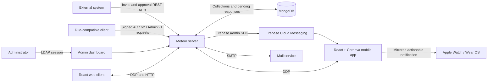

# MIEAuth

[Live website](https://mieauth-prod.os.mieweb.org/) ·
[Try it live](https://mieauth-prod.os.mieweb.org/test-notification) ·
[App Store](https://apps.apple.com/us/app/mie-auth-open-source/id6756409072) ·
[Google Play](https://play.google.com/store/apps/details?id=com.mieweb.mieauth)

MIEAuth is a self-hosted push-authentication service. It combines a Meteor
server, a React web experience, and Cordova applications for iOS and Android.
External systems can enroll users, send approval requests, and wait for an
approve, reject, or timeout response. A Duo-compatible API allows existing Duo
Auth and Admin API clients to use the same users and devices.

This repository contains the server, mobile and web clients, administration
dashboard, operational scripts, and release pipelines.

## Contents

- [What MIEAuth does](#what-mieauth-does)
- [Architecture](#architecture)
- [Technology](#technology)
- [Getting started](#getting-started)
- [Configuration](#configuration)
- [Development workflow](#development-workflow)
- [API surface](#api-surface)
- [Mobile development](#mobile-development)
- [Testing and code quality](#testing-and-code-quality)
- [Operations and deployment](#operations-and-deployment)
- [Project structure](#project-structure)
- [Troubleshooting](#troubleshooting)
- [Known constraints](#known-constraints)

## What MIEAuth does

- Creates one-time, 48-hour registration invites by email or QR code.
- Registers one or more mobile devices per user and tracks device approval.
- Sends Firebase Cloud Messaging (FCM) approval requests to approved devices.
- Correlates phone or paired-watch actions with the originating HTTP request.
- Keeps notification history and active response state in MongoDB.
- Exposes Duo Auth API v2 and Duo Admin API v1 compatibility endpoints.
- Provides an LDAP-protected admin dashboard for users, devices, API keys,
  Duo integrations, and email history.
- Serves public landing, FAQ, privacy, support, and account-deletion pages.
- Supports biometric sign-in, invite deep links, QR scanning, and mobile
  session locking.

Apple Watch and Wear OS support uses mirrored phone notifications; there is no
standalone watch application. Approval actions taken on a watch are processed
by the paired phone and attributed to that phone's device UUID.

## Architecture


```mermaid
flowchart LR
    Integrator[External system] -->|Invite and approval REST APIs| Server
    Duo[Duo-compatible client] -->|Signed Auth v2 / Admin v1 requests| Server
    Admin[Administrator] -->|LDAP session| Dashboard[Admin dashboard]
    Dashboard --> Server[Meteor server]
    Web[React web client] <-->|DDP and HTTP| Server
    Mobile[React + Cordova mobile app] <-->|DDP| Server
    Server <-->|Collections and pending responses| Mongo[(MongoDB)]
    Server -->|Firebase Admin SDK| FCM[Firebase Cloud Messaging]
    FCM --> Mobile
    Mobile -.->|Mirrored actionable notification| Watch[Apple Watch / Wear OS]
    Server -->|SMTP| Mail[Mail service]
```

### Approval request flow

1. An integrator calls `POST /send-notification` for a username.
2. The server validates the request, finds approved devices, records the
   notification, and sends an FCM message to each approved device.
3. A pending response is stored in MongoDB and polled for up to 25 seconds.
4. The user approves or rejects from the app, notification tray, or paired
   watch. The client resolves the pending response through a Meteor method.
5. The original HTTP request returns `approve`, `reject`, or `timeout`.

MongoDB-backed pending responses allow the HTTP request and mobile response to
land on different application instances. Notification state is also synced to
the user's other devices.

## Technology

<!-- prettier-ignore -->
| Area | Current implementation |
| --- | --- |
| Application platform | Meteor 3.4 and Node.js 20 in CI/deployment |
| Client | React 18, React Router 6, `@mieweb/ui`, Framer Motion |
| Mobile | Cordova for iOS and Android |
| Server | Meteor methods, publications, and `WebApp` HTTP handlers |
| Data | MongoDB through Meteor collections |
| Push | Firebase Admin SDK and `@havesource/cordova-plugin-push` 7 |
| Admin authentication | LDAP bind, group membership, in-memory bearer sessions |
| Integration authentication | PBKDF2-hashed API keys and Duo request signatures |
| Build | Meteor Rspack, SWC minimization, PostCSS, Tailwind CSS 4 |
| Quality | Mocha, ESLint 9, Prettier 3, Husky, lint-staged |

## Getting started

### Prerequisites

For server and web development:

- Node.js 20 and npm
- [Meteor](https://docs.meteor.com/about/install.html) 3.4
- Git

Meteor starts a local MongoDB automatically for normal local development. Use
`MONGO_URL` when connecting to an external database.

Mobile builds additionally require:

- Java 17 and Android Studio/Android SDK for Android
- macOS and Xcode for iOS
- Firebase Android and iOS application configuration files
- Signing credentials for distributable builds

### Install

```bash
git clone https://github.com/mieweb/mieweb_auth_app.git
cd mieweb_auth_app
npm install
```

`npm install` also installs the Husky pre-commit hook.

### Run a local server

For the basic web and server application:

```bash
npm run start
```

This generates `public/buildInfo.json` and runs `meteor run`, normally at
`http://localhost:3000`. It does **not** load `settings.json` explicitly. To
load the checked-in Meteor settings file, run:

```bash
meteor run --settings settings.json
```

The web pages and server can run without Firebase, but push delivery is
disabled until `FIREBASE_SERVICE_ACCOUNT_JSON` is configured. Email-backed
invite flows also require mail configuration and `EMAIL_FROM`.

There is no committed local seed or fixture that creates users, API keys, LDAP
accounts, Firebase credentials, or signing credentials. Those must come from
the deployment environment or be created with the management tools below.

### Internal tunnel launcher

```bash
npm run start-dev
```

This is an organization-specific workflow. `bin/start.mjs` requests a YubiKey
OTP, registers a temporary public URL with the BlueHive Magic Box service,
sets `ROOT_URL`, chooses an available port, and starts Meteor with
`settings.json`. Arguments such as `android-device` are passed through and the
generated URL is used as `--mobile-server`.

Developers without access to that service should use `npm run start` or
`meteor run --settings settings.json` instead.

## Configuration

The application loads normal process environment variables and `.env` through
`dotenv`. Keep secrets outside version control. The `private/`,
`server/private/`, `.env*`, signing-key, and local `set-env*.sh` paths are
ignored by Git, but they may exist in a developer workspace.

### Core server settings

<!-- prettier-ignore -->
| Variable | Required | Purpose |
| --- | --- | --- |
| `ROOT_URL` | Production | Canonical application URL; also used for internal notification calls and generated absolute URLs. |
| `PORT` | No | Listening port; Meteor defaults to `3000`. |
| `MONGO_URL` | Production/external DB | MongoDB connection string. Standalone management scripts also use it. |
| `FIREBASE_SERVICE_ACCOUNT_JSON` | Push notifications | Complete Firebase service-account JSON serialized as one environment value. Invalid or absent JSON disables push. |
| `MAIL_URL` | Email | SMTP URL consumed by Meteor Email. |
| `SENDGRID_API_KEY` | Alternative email setup | If `MAIL_URL` is absent, the server constructs a SendGrid SMTP URL. |
| `EMAIL_FROM` | Invite/support/account email | Sender address used by current email flows. |
| `EMAIL_ADMIN` | Support/account workflows | One or more administrative recipient addresses as expected by the server. |
| `SEND_NOTIFICATION_FORCE_AUTH` | Recommended in production | Set to `"true"` to require an API key on `/send-notification`. The default permits unauthenticated requests. |
| `INTERNAL_SERVER_SECRET` | Multi-instance production | Shared secret for server-to-server notification calls. A random per-process fallback is suitable only for local, single-instance use. |
| `DUO_SECRET_ENCRYPTION_KEY` | Duo in production | Exactly 64 hexadecimal characters (32 bytes), used for AES-256-GCM encryption of Duo secret keys at rest. Without it, Duo secrets are stored in plaintext. |

`APP_URL`, `ADMIN_EMAIL`, and `FROM_EMAIL` are referenced only by the legacy
device-approval email helper. Current invite, support, and account workflows
use `ROOT_URL`, `EMAIL_ADMIN`, and `EMAIL_FROM`.

### LDAP admin settings

<!-- prettier-ignore -->
| Variable | Required | Purpose |
| --- | --- | --- |
| `LDAP_URL` | Yes | One or more comma-separated `ldap://` or `ldaps://` URLs, tried in order on connection failure. |
| `LDAP_BASE_DN` | Configured by deployments | Directory base DN; retained in the current LDAP configuration. |
| `LDAP_USER_BASE_DN` | Yes | Base used to construct the user's bind DN. |
| `LDAP_ADMIN_GROUP_DN` | Yes | Group whose members may access the admin dashboard. |
| `LDAP_USER_RDN_ATTR` | No | User RDN attribute; defaults to `uid`. Some directories use `cn`. |
| `LDAP_GROUP_MEMBER_ATTR` | No | Group membership attribute; defaults to `memberUid`. Common `member` and `uniqueMember` forms are also checked. |
| `LDAP_BIND_DN` | Directory-dependent | Service-account DN for group lookup when anonymous search is not allowed. |
| `LDAP_BIND_PASSWORD` | With `LDAP_BIND_DN` | Service-account password. |
| `LDAP_REJECT_UNAUTHORIZED` | No | TLS verification is enabled unless set to `"false"`. Do not disable it in production. |

Admin passwords are encrypted in the browser with an ephemeral RSA-2048 public
key before being submitted, then validated with LDAP bind. HTTPS is still
required in production.

### Meteor settings

`settings.json` defines a public FCM flag and configures Meteor account session
storage. Pass it with `--settings settings.json` when those settings are
required. The file is tracked, despite also matching an entry in `.gitignore`,
so do not add secrets to it.

### Mobile Firebase files

`mobile-config.js` expects both files during a Cordova build:

<!-- prettier-ignore -->
| Platform | Local source path | Packaged destination |
| --- | --- | --- |
| Android | `private/android/google-services.json` | `app/google-services.json` |
| iOS | `private/ios/GoogleService-Info.plist` | `GoogleService-Info.plist` |

The CI workflows create both paths, including a placeholder for the platform
not being built, because the Cordova configuration references both resources.

## Development workflow

### Useful commands

<!-- prettier-ignore -->
| Command | Purpose |
| --- | --- |
| `npm run start` | Generate build metadata and run the local Meteor app. |
| `npm run start-dev` | Run through the private YubiKey/Magic Box tunnel launcher. |
| `npm test` | Run the Meteor Mocha suite once. |
| `npm run test-app` | Run the full-app test target in watch mode. |
| `npm run lint` | Check JavaScript, JSX, and MJS with ESLint. |
| `npm run lint:fix` | Apply ESLint fixes. |
| `npm run format` | Format the repository with Prettier. |
| `npm run format:check` | Check formatting without changing files. |
| `npm run visualize` | Build in production mode with Meteor's bundle visualizer. |
| `npm run prebuild` | Regenerate version, commit, and build-date metadata. |

The pre-commit hook runs `lint-staged`: JavaScript files are formatted and
linted, while JSON, Markdown, CSS, and HTML files are formatted.

### Management tools

All standalone management scripts connect directly to MongoDB. Set `MONGO_URL`
to the same application database before using them. Their local fallback is
`mongodb://localhost:3001/meteor`, except the migration script, whose fallback
is `mongodb://localhost:27017/meteor`.

```bash
# API keys
node manage-api-keys.js generate <client-id>
node manage-api-keys.js list
node manage-api-keys.js regenerate <client-id>
node manage-api-keys.js delete <client-id>

# Duo integrations; type defaults to auth
node manage-duo-integrations.js generate <name> [auth|admin]
node manage-duo-integrations.js list
node manage-duo-integrations.js enable <name>
node manage-duo-integrations.js disable <name>
node manage-duo-integrations.js regenerate <name>
node manage-duo-integrations.js delete <name>
```

API keys and Duo secret keys are displayed only when created or rotated. Store
them immediately in a secret manager.

### Build metadata and app resources

`generate-build-info.js` reads the version from `mobile-config.js`, reads the
current Git commit and date, and writes `public/buildInfo.json`. The support UI
uses this generated file.

Generate all configured iOS and Android icons and launch screens with Pillow:

```bash
python3 -m pip install Pillow
python3 generate_app_resources.py path/to/source.png public/resources
```

The source should be a high-resolution square PNG. The script removes alpha
from iOS icons, preserves Android transparency, and creates the filenames
referenced by `mobile-config.js`.

## API surface

### Public and integration endpoints

<!-- prettier-ignore -->
| Method | Path | Authentication | Purpose |
| --- | --- | --- | --- |
| `POST` | `/api/invite` | API key in `Authorization: Bearer ...` | Create and email a one-time registration invite. |
| `POST` | `/send-notification` | Request-body API key when enforcement is enabled, or internal secret header | Send an approval request and wait up to 25 seconds for a response. |
| `GET`, `HEAD` | `/healthcheck` | None | Report MongoDB reachability and writable-primary status. |
| `GET` | `/api/pending-responses` | None | Return up to 100 response records for monitoring. |
| Various | `/auth/v2/*` | Duo signed request | Duo Auth API compatibility: ping, check, preauth, enroll, auth, and QR generation. |
| Various | `/admin/v1/*` | Duo signed request | Duo Admin API compatibility for user and phone synchronization. |

The invite request and response contract is documented in
[docs/API_INVITES.md](docs/API_INVITES.md). API-key behavior and a complete
notification example are in
[docs/API_KEY_AUTHENTICATION.md](docs/API_KEY_AUTHENTICATION.md).

Minimal notification payload:

```json
{
  "username": "alice",
  "title": "Sign-in request",
  "body": "Approve sign-in to the example service?",
  "actions": [
    { "title": "Approve", "callback": "approve" },
    { "title": "Reject", "callback": "reject" }
  ],
  "apikey": "optional-or-required-by-server-policy",
  "client_id": "example-service"
}
```

Successful delivery returns an action such as:

```json
{
  "success": true,
  "action": "approve",
  "message": "Notification sent successfully"
}
```

`timeout` is also a successful, expected action when the user does not respond
within the request window.

### Admin dashboard

Open `/admin` after configuring LDAP. The dashboard manages:

- API keys
- users and registration approval
- devices and device approval/revocation
- outgoing email records
- Duo Auth and Admin integrations

Admin API calls use an eight-hour bearer session created after LDAP group and
credential validation. See
[docs/ADMIN_DASHBOARD.md](docs/ADMIN_DASHBOARD.md) for the endpoint reference.

## Mobile development

The iOS app requires iOS 15.0 or later.

### Device and emulator runs

Meteor already tracks both mobile platforms in `.meteor/platforms`. With the
native toolchains and Firebase files configured:

```bash
# Android emulator
meteor run android --settings settings.json

# Connected Android device
meteor run android-device --mobile-server=https://reachable-server.example \
  --settings settings.json

# iOS simulator (macOS)
meteor run ios --settings settings.json

# Connected iOS device (macOS)
meteor run ios-device --mobile-server=https://reachable-server.example \
  --settings settings.json
```

A physical device cannot reach a server advertised as `localhost`; use a
reachable HTTPS server or the internal tunnel launcher.

### Production bundles

```bash
# Android AAB
meteor build ./android-build \
  --platforms android \
  --server=https://your-server.example

# iOS Xcode workspace
meteor build ./ios-build \
  --platforms ios \
  --server=https://your-server.example
```

These commands do not provide signing credentials. Android signing and iOS
archive/export steps are implemented in the GitHub Actions workflows and rely
on repository secrets.

The default application ID in `mobile-config.js` is `org.mieweb.opensource`.
Production CI patches Android to `com.mieweb.mieauth`; development CI patches
both mobile builds to `org.mieweb.os.dev` and uses beta branding.

### Watch approval testing

For Apple Watch or Wear OS:

1. Pair the watch and enable notification mirroring/bridging.
2. Install a fresh mobile build. iOS approval categories are registered at app
   startup, so source changes require rebuild and reinstall.
3. Lock or background the phone and send an approval request.
4. Verify Approve and Reject on the wrist, server resolution, timeout behavior,
   and dismissal synchronization across devices.

Use physical hardware for final Apple Watch validation; simulator behavior is
not sufficient for mirrored notification actions.

## Testing and code quality

```bash
npm test
npm run lint
npm run format:check
```

The Meteor Mocha suite currently covers:

- client/server environment behavior and screen-lock state
- expired-registration cleanup and complete user removal
- approval-link error templates and token error classification
- API-key hashing, verification, and management methods
- Duo signature canonicalization, Auth/Admin response envelopes, pagination,
  and user/device mapping
- MongoDB healthcheck behavior, including older `isMaster` fallback

The repository does not currently configure coverage reporting or a separate
pull-request CI workflow. Release workflows build and deploy, but they do not
run `npm test`, lint, or formatting checks before release.

## Operations and deployment

### Healthcheck

```bash
curl http://localhost:3000/healthcheck
```

The endpoint returns `200` only when MongoDB responds to `ping` and reports the
connected node as writable. It returns `503` for a disconnected or read-only
database. `HEAD` is supported for probes.

### Multi-instance setup

Pending approvals are shared through MongoDB. Indexes are created at Meteor
startup, but the repository also provides a migration/verification utility:

```bash
MONGO_URL="mongodb://host/database" node migrate-multi-instance.js --dry-run
MONGO_URL="mongodb://host/database" node migrate-multi-instance.js
```

The non-dry run deletes all existing `pendingResponses` records before
creating and verifying indexes. Do not run it while live approvals are active.
Every application instance must use the same MongoDB database and the same
`INTERNAL_SERVER_SECRET`.

The detailed design is in
[docs/MULTI_INSTANCE_SOLUTION.md](docs/MULTI_INSTANCE_SOLUTION.md).

### systemd

The `scripts/` directory holds every shell script in the repository — the
systemd unit, provisioning and install helpers, the startup wrapper, the mobile
build/signing scripts, and the diagnostic tools. The deployment ones assume a
particular Linux user, home-directory layout, Node installation, and
`set-env.sh` location. Review and adapt them before using them on another host.

### Releasing

`.github/workflows/release.yml` is the single entry point for all three release
targets. The tag names the target; `variants/<target>.env` supplies the app IDs,
display name, URL scheme, server URL, Play track, branch, and deploy mode.

<!-- prettier-ignore -->
| Tag | Target | App | Server |
| --- | --- | --- | --- |
| `mie-os-dev-v*` | `mie-os-dev` | MIEWeb Auth Opensource Beta (`org.mieweb.os.dev`) | `mieauth-dev.os.mieweb.org` |
| `mie-os-prod-v*` | `mie-os-prod` | MIEWeb Auth Opensource (`com.mieweb.mieauth` Android, `org.mieweb.opensource` iOS) | `mieauth-prod.os.mieweb.org` |
| `mie-v*` | `mie` | MIEWeb Auth (`org.mieweb.auth`) | `mieauth.mieweb.org` |

`mie-os-dev-v*` tags are cut on `development`; the other two on `main`. The
retired `v*` and `dev-v*` tags now fail the run with an explicit error instead of
being skipped silently.

Releasing from a tag deploys the server, builds both platforms, and publishes.
Manual runs (Run workflow) narrow that down:

<!-- prettier-ignore -->
| Task | Inputs |
| --- | --- |
| Server-only hotfix | `deploy_server: true`, `include_mobile: false` |
| Rebuild iOS from a tag | pick the tag in "Use workflow from", `deploy_server: false`, `include_mobile: true`, `platforms: ios` |
| Dry run a signed build | `include_mobile: true`, `publish: false` — artifacts only, no store upload |

The mobile build compiles whatever ref the run was started from. SSH server
deploys always take the branch from the variant file, because the build happens
on the remote host.

Both halves are reproducible locally from the same sources of truth:

```bash
EVENT_NAME=release TAG=mie-v1.2.3 bash scripts/resolve-release-target.sh
bash scripts/build-mobile-local.sh mie ios
```

Mobile builds run through the shared `mieweb/actions` pipeline, pinned to an
exact tag. iOS signs via `match` (team-level certificate); Android signs from a
per-app keystore. Secrets are mapped explicitly per target — the unprefixed names
belong to the opensource app and the `MIE_*` names to MIEWeb Auth — so a build
can never be signed with the wrong key. Secret values are intentionally not
documented here.

### Retired release workflows

The three `deploy-and-publish-miewebauth*.yml` workflows and the manual
`test-ios-fastlane.yml` experiment were removed once `release.yml` was proven
end to end for every target. `release.yml` is now the only release path.

## Project structure

<!-- prettier-ignore -->
| Path | Responsibility |
| --- | --- |
| `client/main.jsx` | Shared client entry point and Cordova initialization. |
| `client/mobile/` | Biometrics, device capture, deep links, push handling, and mobile React UI. |
| `client/web/` | Public website pages and shared web layout. |
| `server/main.js` | Server entry point, REST handlers, registration, email, notification, and Meteor methods. |
| `server/adminAuth.js` | LDAP authentication, RSA credential transport, and admin sessions. |
| `server/adminApi.js` | Admin dashboard REST endpoints. |
| `server/firebase.js` | Firebase initialization and FCM delivery. |
| `server/duo/` | Duo Auth API v2 and Admin API v1 compatibility layers. |
| `server/templates/` | Admin and approval-result HTML templates. |
| `utils/api/` | MongoDB collections and related Meteor methods/publications. |
| `tests/` | Meteor Mocha server and client tests. |
| `docs/` | Focused API, admin, and multi-instance documentation. |
| `scripts/` | All shell scripts: systemd unit, server provisioning, mobile build/signing, and diagnostics. |
| `variants/` | Per-release-target identity: app IDs, display name, URL scheme, server URL, Play track, branch, deploy mode. |
| `.github/workflows/` | Release pipeline plus the manual iOS automation. |
| `mobile-config.js` | Cordova metadata, native preferences, plugins, Firebase files, icons, and launch screens. |
| `rspack.config.js` | Meteor Rspack/SWC optimization. |
| `generate_app_resources.py` | Mobile icon and launch-screen generator. |

`_build/`, `android-build/`, `ios-build/`, `public/build-chunks/`, and
`public/buildInfo.json` are generated outputs or local artifacts, not primary
source directories.

## Troubleshooting

### Push is disabled or every request times out

- Confirm `FIREBASE_SERVICE_ACCOUNT_JSON` is set and parses as JSON; startup
  logs explicitly report whether Firebase initialized.
- Confirm the user has at least one approved device with a current FCM token.
- Reopen the mobile app to refresh token registration.
- Confirm the mobile build contains the Firebase file for its platform.
- A normal no-response result is `action: "timeout"` after approximately 25
  seconds; transport errors return an error response instead.

### Mobile device cannot connect

- Do not advertise `localhost` as `--mobile-server` to a physical device.
- Use a reachable HTTPS URL and make `ROOT_URL` match it.
- Confirm the device trusts the TLS certificate and can reach the host.

### Admin login fails

- Verify all required LDAP variables and the constructed user DN.
- For failover, provide comma-separated LDAP URLs.
- If group searches reject anonymous access, configure `LDAP_BIND_DN` and
  `LDAP_BIND_PASSWORD`.
- Leave certificate verification enabled and install the correct CA rather
  than setting `LDAP_REJECT_UNAUTHORIZED=false` in production.
- Admin sessions are in memory; a restart invalidates every session.

### Responses fail in a multi-instance deployment

- Ensure all instances use the same `MONGO_URL`.
- Ensure all instances use the same `INTERNAL_SERVER_SECRET`.
- Check `/healthcheck` on each instance and inspect
  `/api/pending-responses` during a request.
- Verify the pending-response TTL and lookup indexes exist.

### Standalone management script uses the wrong database

Always set `MONGO_URL` explicitly. A local Meteor development database often
runs on port 3001, while a separately installed MongoDB commonly runs on 27017.
The scripts have different fallbacks, so relying on defaults can modify the
wrong database.

### Mobile build cannot find Firebase resources

Create both `private/android/google-services.json` and
`private/ios/GoogleService-Info.plist`. `mobile-config.js` references both even
when building only one platform.

## Known constraints

- The YubiKey/Magic Box development launcher and server deployment scripts are
  tied to internal MIEWeb infrastructure; no public replacement service or
  generic deployment manifest is included.
- Firebase projects, LDAP schema values, mail service, app-store accounts, and
  signing material cannot be inferred from source and must be supplied by the
  operator.
- Admin sessions are process-local. Behind a load balancer, use session affinity
  or redesign the session store; MongoDB-backed approval responses do not solve
  admin-session sharing.
- `/api/pending-responses` is currently unauthenticated and may expose request
  metadata. Restrict it at the reverse proxy or add application authentication
  before exposing it outside a trusted network.
- `/send-notification` allows unauthenticated requests unless
  `SEND_NOTIFICATION_FORCE_AUTH=true`. Production deployments should enable
  enforcement.
- The migration utility advertises `--force`, but the current implementation
  does not use that flag; it also removes pending responses without prompting.
- The focused documents under `docs/` include some historical implementation
  notes. When they conflict with source, `server/`, `client/`, and the current
  workflows are authoritative.

## License

MIEAuth is available under the [MIT License](LICENSE).
