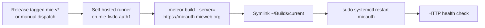

# MIE Auth Instance — `mieauth.mieweb.org`

Setup notes for the **MIE-internal** MIEAuth instance on host `mie-fwdc-auth1`.

This is a **separate application** from the opensource app. It has its own
database and its own user base — nothing is migrated from
`mieauth-prod.os.mieweb.org`, which continues to run untouched via
[deploy-production.yml](.github/workflows/deploy-production.yml).

|             | Opensource app                 | MIE instance                          |
| ----------- | ------------------------------ | ------------------------------------- |
| URL         | `mieauth-prod.os.mieweb.org`   | `mieauth.mieweb.org`                  |
| Host        | Proxmox container (SSH deploy) | `mie-fwdc-auth1` (self-hosted runner) |
| Workflow    | `deploy-production.yml`        | `deploy-mieauth.yml`                  |
| Release tag | `v*`                           | `mie-v*`                              |
| Database    | `mieweb_auth`, standalone      | `mieauth`, replica set `mieauth-rs`   |
| Users       | Existing                       | Fresh — no import                     |

## Host facts

Audited 2026-08-17 via [scripts/server-inventory.sh](scripts/server-inventory.sh):

| Item                | State                                                                   |
| ------------------- | ----------------------------------------------------------------------- |
| OS                  | Debian 12 bookworm, LXC container, 4 CPU, 4 GB RAM + 4 GB swap          |
| Sudo user           | `aabrol` (uid 7548, group `mieremote`), passwordless sudo               |
| Service/runner user | `actions` — owns the toolchain and `~/Builds`                           |
| MongoDB             | 8.0.29, replica set `mieauth-rs`, authenticated, database `mieauth`     |
| TLS / ingress       | cloudflared tunnel — no nginx, no certbot                               |
| Actions runner      | `actions.runner.mieweb-mieweb_auth_app.mie-fwdc-auth1`                  |
| Mail                | `smtp-lb.med-web.com:25`                                                |
| LDAP                | `ldaps://ldap.med-web.com:636` (med-web.com directory; no SSSD on host) |

## 1. Provisioning

```bash
TARGET_USER=actions bash scripts/provision-server.sh
```

The runner executes as `actions` while `aabrol` holds sudo, so the script does
system-level work (apt) as the invoking user and installs the per-user toolchain
as `actions`. Node, Meteor, and `~/Builds` must belong to `actions` or the CI job
cannot find them.

## 2. Ingress — Cloudflare Tunnel, not nginx

Cloudflare terminates TLS; there is no vhost or certificate to manage. The tunnel
is **dashboard-managed** (`cloudflared tunnel run --token-file /etc/cloudflared/token`),
so there is no `config.yml` on the server. Routing is set in:

> Zero Trust → Networks → Tunnels → _(mie-fwdc-auth1 tunnel)_ → Public Hostname

with `mieauth.mieweb.org` → service **HTTP** `localhost:3000`.

WebSocket upgrades (Meteor's DDP) are proxied automatically. A **502** means
nothing is listening on port 3000 yet.

## 3. Environment

`/home/actions/scripts/set-env.sh`, owned by `actions`, mode `600`:

```bash
export ROOT_URL='https://mieauth.mieweb.org'
export APP_URL='https://mieauth.mieweb.org'
export PORT=3000
export MAIL_URL='smtp://smtp-lb.med-web.com:25'
export MONGO_URL='mongodb://mieauth:<PASSWORD>@mie-fwdc-auth1.med-web.com:27017/mieauth?replicaSet=mieauth-rs&authSource=admin'
export MONGO_OPLOG_URL='mongodb://mieauth:<PASSWORD>@mie-fwdc-auth1.med-web.com:27017/local?replicaSet=mieauth-rs&authSource=admin'

# LDAP (admin panel) — med-web.com directory, not the mieweb.org cluster
export LDAP_URL="ldaps://ldap.med-web.com:636"
export LDAP_BASE_DN="dc=med-web,dc=com"
export LDAP_USER_BASE_DN="ou=people,dc=med-web,dc=com"
export LDAP_USER_RDN_ATTR="uid"
export LDAP_ADMIN_GROUP_DN="cn=mie,ou=secgroup,dc=med-web,dc=com"
export LDAP_GROUP_MEMBER_ATTR="uniqueMember"
export LDAP_REJECT_UNAUTHORIZED="true"
```

Notes:

- `MONGO_OPLOG_URL` enables Meteor's oplog tailing. Without it reactivity falls
  back to polling; it is non-fatal but slower.
- This instance authenticates against the **med-web.com** directory on standard
  LDAPS port 636 with `uniqueMember` group membership — different directory,
  port, and membership attribute from the opensource app's mieweb.org cluster.
- No `LDAP_BIND_DN` / `LDAP_BIND_PASSWORD` is set, so the admin-group lookup uses
  an **anonymous search** ([server/adminAuth.js](../server/adminAuth.js#L514)).
  If the directory ever refuses anonymous searches, logins fail as
  `NOT_IN_GROUP` and a service-account bind would need to be added.
- `LDAP_REJECT_UNAUTHORIZED=true` means the LDAPS certificate must validate. Do
  not re-enable `NODE_TLS_REJECT_UNAUTHORIZED=0`, which would silently defeat it.
- **`FIREBASE_SERVICE_ACCOUNT_JSON` must be this instance's own Firebase
  project.** The value carried over from the repo template points at
  `mieweb-auth-dev` and will not deliver push notifications to this app's users.

## 4. Service

```bash
SVC_USER=actions bash scripts/setup-systemd.sh
```

`scripts/mieauth.service` is a template — the installer substitutes the service
user, group, and home at install time, and writes a sudoers rule granting that
user passwordless `systemctl restart mieauth` (what the CI job calls).

The service cannot start until a build exists, since `WorkingDirectory` points at
`~/Builds/current`.

## 5. Deploying



[deploy-mieauth.yml](.github/workflows/deploy-mieauth.yml) is server-only and
runs on either a `mie-v*` release or a manual **Run workflow** dispatch. It is
gated so the opensource `v*` releases never touch this host.

## 6. Mobile apps

Both platforms use the bundle/package ID **`org.mieweb.auth`**, distinct from the
opensource app (`com.mieweb.mieauth` on Android, `org.mieweb.opensource` on iOS)
so the two can be installed side by side.

[mobile-config.js](mobile-config.js) is left untouched in the repo — it belongs to
the opensource app. The workflow patches it at build time:

| Field        | Patched to                                |
| ------------ | ----------------------------------------- |
| `id`         | `org.mieweb.auth`                         |
| `URL_SCHEME` | `miewebauth` (opensource keeps `mieauth`) |
| `website`    | `https://mieauth.mieweb.org`              |
| `version`    | from the `mie-v*` tag                     |

The URL scheme must differ, otherwise an invite deep link is ambiguous when both
apps are installed on one device. Deep links use the custom scheme only — there
are no Universal Links, so no `assetlinks.json` or `apple-app-site-association`
to host.

### Required secrets

Mobile jobs are skipped unless triggered by a `mie-v*` release or a dispatch with
**include mobile** checked, so the server can be deployed before these exist.

| Secret                                                                             | Purpose                                          |
| ---------------------------------------------------------------------------------- | ------------------------------------------------ |
| `MIE_FIREBASE_SERVICES_JSON_BASE64`                                                | `google-services.json` for `org.mieweb.auth`     |
| `MIE_FIREBASE_IOS_PLIST_BASE64`                                                    | `GoogleService-Info.plist` for `org.mieweb.auth` |
| `MIE_ANDROID_KEYSTORE_BASE64`                                                      | Signing keystore                                 |
| `MIE_ANDROID_KEYSTORE_PASSWORD`                                                    | Keystore password                                |
| `MIE_ANDROID_KEY_PASSWORD`                                                         | Key password                                     |
| `MIE_ANDROID_KEYSTORE_ALIAS`                                                       | Key alias                                        |
| `MIE_GOOGLE_PLAY_SERVICE_ACCOUNT_JSON`                                             | Play Console upload                              |
| `MIE_IOS_DIST_CERT_P12_BASE64`                                                     | Distribution certificate                         |
| `MIE_IOS_DIST_CERT_PASSWORD`                                                       | Certificate password                             |
| `MIE_IOS_PROVISIONING_PROFILE_BASE64`                                              | App Store profile for `org.mieweb.auth`          |
| `MIE_APPLE_TEAM_ID`                                                                | Apple developer team                             |
| `MIE_APPLE_API_KEY_ID` / `MIE_APPLE_API_ISSUER_ID` / `MIE_APPLE_API_KEY_P8_BASE64` | App Store Connect API key                        |

Prerequisites that cannot be automated:

- A **new Firebase project** (or at least new apps registered for
  `org.mieweb.auth`) — its service account also replaces
  `FIREBASE_SERVICE_ACCOUNT_JSON` in `set-env.sh`.
- A **new App Store Connect app record** and provisioning profile for
  `org.mieweb.auth` — the existing profile only covers `org.mieweb.opensource`,
  and the build fails fast if the profile does not match.
- A **new Play Console listing** for `org.mieweb.auth`. The first AAB for a new
  package must be uploaded manually before the API will accept automated uploads.

## 7. Operations

```bash
sudo systemctl status mieauth
sudo journalctl -u mieauth -f
sudo systemctl restart mieauth
```

Re-run [scripts/server-inventory.sh](scripts/server-inventory.sh) at any time —
it is read-only and reports toolchain, database, ports, tunnel, and service state.
