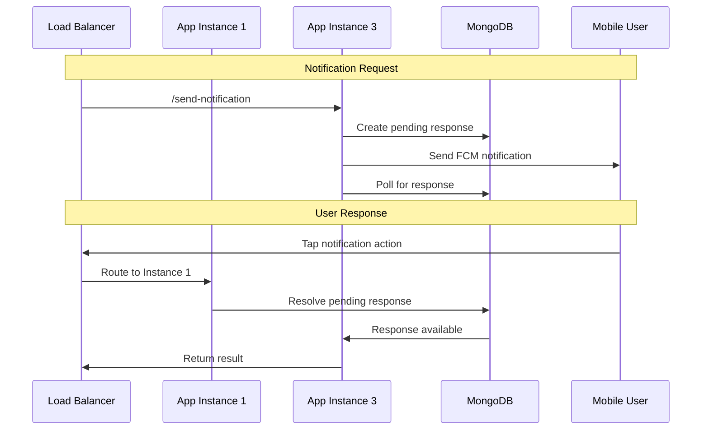

# Multi-Instance MongoDB-Based Pending Responses Solution

## Problem Solved

Previously, your application used in-memory Maps (`responsePromises` and `pendingNotifications`) to handle notification responses. This caused issues in a multi-instance deployment where:

1. **App Instance 3** sends a notification and stores the response promise in its memory
2. **User** responds via **App Instance 1** (due to load balancer)
3. **App Instance 3** times out because it never receives the response
4. **App Instance 1** receives the response but has no pending promise to resolve

## Solution Overview

The new solution replaces in-memory storage with MongoDB-based shared state using a new `PendingResponses` collection.

## Key Components

### 1. PendingResponses Collection (`utils/api/pendingResponses.js`)

**Schema:**

```javascript
{
  username: String,        // User who should respond
  requestId: String,       // Unique identifier for this request
  status: String,          // 'pending', 'resolved', 'timeout'
  action: String,          // User's response: 'approve', 'reject', 'timeout'
  createdAt: Date,         // When request was created
  expiresAt: Date,         // When request expires (TTL index)
  resolvedAt: Date         // When request was resolved
}
```

**Key Methods:**

- `pendingResponses.create()` - Create a new pending response
- `pendingResponses.resolve()` - Mark a response as resolved
- `pendingResponses.waitForResponse()` - Poll for response with timeout
- `pendingResponses.cleanup()` - Remove expired entries

### 2. Modified Server Logic (`server/main.js`)

**Before (In-Memory):**

```javascript
const responsePromises = new Map();

// Store promise in memory
responsePromises.set(username, resolve);

// Resolve from same instance only
if (responsePromises.has(username)) {
  const resolve = responsePromises.get(username);
  resolve(action);
}
```

**After (Database):**

```javascript
// Create pending response in database
const requestId = Random.id();
await Meteor.callAsync("pendingResponses.create", username, requestId, 25000);

// Wait for response using database polling
const userResponse = await Meteor.callAsync(
  "pendingResponses.waitForResponse",
  username,
  requestId,
  25000,
);

// Resolve from any instance
await Meteor.callAsync("pendingResponses.resolve", username, action);
```

## How It Works

### 1. Notification Flow



### 2. Database Operations

**Creating Pending Response:**

```javascript
// Any instance can create
await PendingResponses.insertAsync({
  username: "john.doe",
  requestId: "req_123",
  status: "pending",
  expiresAt: new Date(Date.now() + 25000),
});
```

**Resolving Response:**

```javascript
// Any instance can resolve
await PendingResponses.updateAsync(
  { username: "john.doe", status: "pending" },
  { $set: { status: "resolved", action: "approve" } },
);
```

**Polling for Response:**

```javascript
// Instance 3 polls every 500ms
const pollForResponse = async () => {
  const response = await PendingResponses.findOneAsync({
    username,
    requestId,
    status: "resolved",
  });

  if (response) return response.action;
  // Continue polling until timeout
};
```

## Features

### 1. Automatic Cleanup

- **TTL Index**: MongoDB automatically removes expired documents
- **Manual Cleanup**: Runs every minute to clean up stale entries
- **No Memory Leaks**: No risk of growing in-memory collections

### 2. Monitoring

- **Endpoint**: `GET /api/pending-responses`
- **Purpose**: Monitor active pending responses across all instances
- **Returns**: List of all pending/resolved responses

### 3. Backward Compatibility

- Old `userAction` method preserved for compatibility
- Existing notification APIs work unchanged
- Database polling provides same synchronous behavior

## Configuration

### Database Indexes

```javascript
// Automatically created on startup
PendingResponses.createIndex({ username: 1 });
PendingResponses.createIndex({ requestId: 1 });
PendingResponses.createIndex({ expiresAt: 1 }, { expireAfterSeconds: 0 });
```

### Environment Variables

No new environment variables required. Uses existing MongoDB connection.

## Performance Considerations

### 1. Polling Frequency

- **Interval**: 500ms (configurable)
- **Trade-off**: Lower = more responsive, higher DB load
- **Recommendation**: 500ms provides good balance

### 2. Database Load

- **Reads**: ~2 queries per second per pending notification
- **Writes**: 2 writes per notification (create + resolve)
- **Impact**: Minimal for typical notification volumes

### 3. Scaling

- **Horizontal**: Scales with number of app instances
- **Vertical**: MongoDB handles concurrent polling efficiently
- **Limits**: No inherent limits, scales with MongoDB capacity

## Testing

### 1. Multi-Instance Test

```bash
node testMultiInstance.js
```

### 2. Database Operations Test

```javascript
// Test pending response lifecycle
await Meteor.callAsync("pendingResponses.create", "testuser", "req123", 30000);
await Meteor.callAsync("pendingResponses.resolve", "testuser", "approve");
```

### 3. Monitoring

```bash
curl http://localhost:3000/api/pending-responses
```

## Migration Guide

### 1. Deploy Changes

1. Deploy new code to all instances
2. MongoDB indexes created automatically
3. No downtime required

### 2. Verify Operation

1. Check `/api/pending-responses` endpoint
2. Send test notifications
3. Monitor database for pending entries

### 3. Rollback Plan

If issues occur:

1. Revert to previous code version
2. Drop `pendingResponses` collection
3. Original in-memory system restored

## Troubleshooting

### Common Issues

**1. Responses Not Resolving**

- Check `/api/pending-responses` for stuck entries
- Verify database connectivity
- Check polling interval timing

**2. Timeouts Still Occurring**

- Verify all instances using new code
- Check username matching logic
- Monitor database query performance

**3. Database Performance**

- Monitor pending responses collection size
- Check index usage with `explain()`
- Adjust cleanup frequency if needed

### Debug Logs

```javascript
// Enable detailed logging
console.log(`Created pending response for ${username} with ID ${requestId}`);
console.log(`Resolved pending response for ${username} with action: ${action}`);
```

## Benefits

1. **✅ Multi-Instance Compatible**: Works across any number of app instances
2. **✅ No Code Changes Required**: Existing APIs work unchanged
3. **✅ Automatic Cleanup**: No memory leaks or orphaned data
4. **✅ Monitoring Capable**: Built-in monitoring and debugging
5. **✅ Scalable**: Scales with your MongoDB infrastructure
6. **✅ Fault Tolerant**: Handles instance failures gracefully

## Next Steps

Consider these future enhancements:

1. **Redis Migration**: For even better performance
2. **WebSocket Events**: Replace polling with real-time events
3. **Metrics Collection**: Track response times and success rates
4. **Load Testing**: Verify performance under high load
